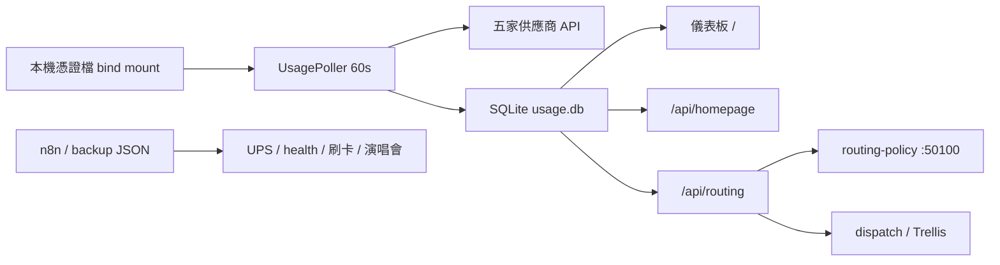

# limit-usage

自架的 AI 訂閱額度儀表板與額度感知模型路由器。每 60 秒輪詢 Codex、SuperGrok、DeepSeek、Google Antigravity、Claude Code 五家剩餘配額，存進 SQLite；對外提供給人看的儀表板、給 Homepage 卡片吃的扁平 JSON，以及給多廠商 CLI 派工腳本（`dispatch`／Trellis）查「現在哪個模型還有額度」的 `/api/routing`。使用者是站主本人與其自動化派工腳本。

技術棧：FastAPI · SQLite · Chart.js · Docker Compose · pytest · 五家供應商額度 API

## 解決的問題

多個 AI CLI 訂閱各有 5 小時／週額度，沒有統一視圖。派工到已耗盡的池會浪費一整輪。Claude 官方額度端點每帳號限流，直接輪詢會被 429 一小時。

## 功能

- 五家供應商額度輪詢與解析（含 token 自動 refresh）
  - Codex：`app/providers/codex.py`（`WHAM_USAGE_URL`、`parse_rate_limit_windows`、`try_refresh_token`）
  - SuperGrok：`app/providers/supergrok.py`（gRPC-web protobuf 手刻解碼、OIDC refresh 並回寫 `~/.grok/auth.json`）
  - DeepSeek：`app/providers/deepseek.py`（`/user/balance` 餘額 CNY）
  - Antigravity（Google Cloud Code）：`app/providers/antigravity.py`（配額 bucket，分 Gemini／3P 兩族）
  - Claude：`app/providers/claude.py`（stream capture、statusline capture、Claude Code usage cache、OAuth fallback 合併）
- 背景輪詢器：每供應商 min-interval、指數退避、遵守 `Retry-After`、失敗時沿用上次好資料。`app/services/poller.py`
- SQLite 快照＋歷史。`app/db/repository.py`
- 7 日趨勢與燃燒率工作量估算。`app/services/analytics.py`
- Homepage 扁平 JSON。`app/services/homepage_view.py`
- 額度感知模型路由 `/api/routing`。`app/services/routing_view.py`
- 派工回饋冷卻（9router 式 backoff）。`app/services/routing_feedback.py`
- 跨主機 Claude 額度推送與合併。`app/services/remote_claude.py`、`deploy/claude-usage-push.py`
- Claude 活動探測（只看 `~/.claude/projects` mtime）。`app/services/claude_activity.py`
- 主機周邊 companion API：UPS（`app/services/ups.py`，`upower -i`）、三主機備份健康、本月刷卡、演唱會追蹤——後三者只讀 n8n／backup 產出的 JSON
- 儀表板前端：`app/web/templates/index.html`、`app/web/static/app.js`（Chart.js）、`style.css`
- 子服務 routing-policy：純政策決策層，無憑證。公網 `routing.piea.uk` 經 CF Tunnel + Access → homepage-edge → `:50100`。`routing-policy/`
- 一次性 Google OAuth 登入工具。`scripts/antigravity_login.py`

儀表板會話：週額度剩餘 ≤20%／≤10% 或重置倒數 2h／30m 時紅字；DeepSeek 餘額低於 10 CNY 警告；7 日折線與 light／medium／heavy 工作量估算。

## 畫面

儀表板 `http://127.0.0.1:50048/`。無登入、無 basic auth；只綁 loopback／tailnet，靠網路邊界保護。標題「limit-usage · AI 額度儀表板」，有立即刷新、伺服器時間／下次輪詢、五張供應商卡＋本月刷卡卡、下方 7 日趨勢 Chart.js。

**Homepage slug：無**（server-side widget only，禁止公網直出）。Homepage 卡片以 `widget.url: http://127.0.0.1:50048/api/...` 讀；`/limit-usage` 只是 Homepage panel path。外網 `https://usage.piea.uk` 走 Cloudflare Access service token，不是瀏覽器登入。

| 儀表板 | 全頁 |
|---|---|
|  |  |

適合截圖的 JSON：`/api/usage`、`/api/homepage`、`/api/trends?days=7`、`/api/routing?tier=T2`、`/api/routing/feedback`、`/api/system/health`、`/api/host/ups`。

routing-policy：`http://127.0.0.1:50100/v1/health`、`/v1/policy`、`POST /v1/recommend`（`/docs` 刻意關閉）。

## 架構



元件：FastAPI（`app/main.py` `create_app`，lifespan 內啟動 `UsagePoller`、`FeedbackRegistry`、`RemoteClaudeRegistry`）＋ SQLite ＋ 靜態前端。同 compose 內另有 `routing-policy` FastAPI。

資料流：

1. 輸入：本機憑證檔（唯讀 bind mount 到 `/secrets/...`）→ 各 provider 打廠商 API。Claude 優先讀本機檔，最後才打 `api.anthropic.com/api/oauth/usage`。
2. 處理：`UsagePoller._poll_unlocked` 每 60s（`POLL_INTERVAL_SECONDS`，最小 15）→ `AccountSnapshot`（`UsageWindow` 帶 `used_percent` / `remaining_percent` / `resets_at`）。
3. 儲存：`data/usage.db` 兩張表。只有 `status=ok` 才寫歷史。路由冷卻與遠端 Claude 讀數皆為記憶體內，重啟即清。
4. 輸出：`/`、`/api/usage`、`/api/homepage`、`/api/trends`、`/api/routing`、`/api/system/health` 等。

外部 API：`chatgpt.com/backend-api/wham/usage`（refresh 走 `auth.openai.com`）、`grok.com` gRPC-web `GetGrokCreditsConfig`（refresh 走 `auth.x.ai`）、`api.deepseek.com/user/balance`、`daily-cloudcode-pa.googleapis.com`（refresh 走 `oauth2.googleapis.com`）、Anthropic OAuth usage。

## 資料模型／資料處理成果

2026-09-17 實測。

| 表名／檔案 | 筆數或產物 |
|---|---|
| `latest_snapshots` | 5 列（provider PK；五家皆 `ok`） |
| `usage_history` | 308,527 列：codex 91,159（自 2026-07-11）、supergrok 89,549、deepseek 82,664、antigravity 28,601（自 08-26）、claude 16,554（自 09-03） |
| `data/usage.db` | 302 MB；無 prune，持續成長 |
| `/api/homepage` | 約 50 個扁平欄位 |
| `/api/routing?tier=T2` | 依 catalog 推導的 T2 候選中，額度分數最高者 |
| 派工回饋（記憶體，約 2 天） | codex 14 成功／1 失敗、agy 18、claude 7、grok 4 |
| routing-policy | `policy_version` `2026-09-26.1` |
| `catalog/models.yaml` | `catalog_version` `2026-09-26.1`，16 個模型 |

`latest_snapshots(provider PK, payload, fetched_at, status)`；`usage_history(id, provider, payload, fetched_at)` 加索引。

## 自動化

| 名稱 | 週期 | 做什麼 | 產出 |
|---|---|---|---|
| 容器內 `UsagePoller` | 每 60s（失敗指數退避上限 900s） | 輪詢五家；`/api/refresh` 強制刷新有 10s 節流 | `usage.db` 快照與歷史 |
| `limit-usage-claude-monitor.timer` | 每 2 分鐘（active） | `deploy/claude-usage-cache-sync.py` 從 `~/.claude.json` 抽 `cachedUsageUtilization` 原子寫出 | `~/.claude-monitor/state/claude-code-usage.json` |
| `limit-usage-claude-push.timer` | 每 2 分鐘（遠端主機） | `deploy/claude-usage-push.py` 推兩個檔到 `POST /api/ingest/claude` | 遠端 Claude 讀數（合併看觀測時間，不看到達時間） |
| dispatch 回饋 | 每次派工後 | `POST /api/routing/feedback`；限流／429 → 60s、120s、240s…；401/402/403 → 5 分鐘；上限 30 分鐘 | 記憶體內冷卻 |
| `limit-usage-cli-models.timer` | 每 6 小時（開機後 2 分鐘首次） | `deploy/cli-models-export.py` 匯出 codex（讀 `~/.codex/models_cache.json`）／agy（`agy models`）／grok（`grok models`）可用模型清單，原子寫出 | `data/cli-models.json` |

本機 `/api/ingest/claude` 目前 `host_count: 0`，尚無外部主機在推。無主動告警；警示只體現在儀表板紅字與 `level: low/critical`。

## 部署與執行

### 埠與 slug

| 項目 | 值 |
|---|---|
| `limit-usage` | `127.0.0.1:50048` 與 tailnet `100.64.128.70:50048` |
| `routing-policy` | `127.0.0.1:50100` |
| Homepage slug | **無**（server-side widget only） |
| unit | `infisical-stack@limit-usage` |
| 舊 unit | `deploy/limit-usage.service` 已被 `deploy/retire-systemd.sh` 取代 |

映像 `limit-usage:local`。`Dockerfile` 只有 `FROM limit-usage:local` + `COPY app`，base image 必須先存在。healthcheck 打 `/api/health`。UPS 需 `apparmor:unconfined` + 掛 host D-Bus。tailnet 綁定在冷開機可能輸給 tailscaled，靠 `restart: unless-stopped` 重試。Docker published port 繞過 ufw，絕不可綁 `0.0.0.0`（寫入端點無認證）。

### 啟動（2026-09 更新）

不要複製 `.env` 當運行時來源。不要直接 `docker compose up`：會把 `DEEPSEEK_API_KEY` 靜默代換成空字串。

```bash
cd /home/pieye/Container/limit-usage

# 停掉舊的 user unit（若還在）
systemctl --user disable --now limit-usage.service 2>/dev/null || true

/home/pieye/Container/scripts/with-infisical limit-usage -- docker compose up -d
docker compose ps
curl -sS http://127.0.0.1:50048/api/health
```

`docker compose restart` 不重建容器、保留原環境，是安全的。掛載：`./data`、`~/.codex/auth.json`（ro）、`~/.grok/auth.json`（rw，供 token 輪換）、Claude／claude-monitor **目錄**（不要單檔）、n8n 快取 JSON、三主機健康證據。

本機手動跑（密鑰仍由 Infisical 注入）：

```bash
python -m venv .venv
source .venv/bin/activate
pip install -r requirements.txt
/home/pieye/Container/scripts/with-infisical limit-usage -- \
  python -m uvicorn app.main:app --host 127.0.0.1 --port 50048
```

只在不用 Docker 時才裝舊 unit：`./deploy/install-user-service.sh`。

### Infisical folder 與變數名稱

Infisical folder `/limit-usage` 只有一個密鑰名 `DEEPSEEK_API_KEY`。其他敏感資料是 bind mount 的憑證檔，不是環境變數。

| 名稱 | 預設 | 說明 |
|---|---|---|
| `DEEPSEEK_API_KEY` | （Infisical） | DeepSeek API |
| `PORT` | `50048` | HTTP 埠 |
| `POLL_INTERVAL_SECONDS` | `60` | 背景輪詢間隔 |
| `CODEX_AUTH_PATH` | `~/.codex/auth.json` | `codex login` 的 OAuth |
| `GROK_AUTH_PATH` | `~/.grok/auth.json` | `grok login` |
| `SUPERGROK_COOKIE` | — | 可選 grok.com session cookie |
| `ANTIGRAVITY_TOKEN_PATH` | `~/.gemini/antigravity-acp/acp_token.json` | Google OAuth |
| `CLAUDE_STATUSLINE_CAPTURE_PATH` | `~/.claude-monitor/statusline/latest.json` | statusline capture |
| `CLAUDE_USAGE_CACHE_PATH` | `~/.claude-monitor/state/claude-code-usage.json` | Claude Code usage cache 副本 |
| `CLAUDE_OFFICIAL_MAX_AGE_SECONDS` | `21600` | 本機檔超過此時效則忽略 |
| `CLAUDE_OAUTH_MIN_INTERVAL_SECONDS` | `1800` | OAuth fallback 間距 |
| `CLAUDE_CREDENTIALS_PATH` | `~/.claude/.credentials.json` | OAuth fallback 與 tier 提示 |
| `CLAUDE_PROJECTS_DIR` | `~/.claude/projects` | 只看 mtime |
| `DATABASE_PATH` | `./data/usage.db` | SQLite |

`.env.example` 只列名稱，不是運行時來源。

### 供應商對照

| 供應商 | 畫面 |
|---|---|
| Codex | 5 小時 + 週剩餘 % 與重置倒數 |
| SuperGrok | 週／billing pool % 與重置（best-effort） |
| DeepSeek | API 餘額（total / granted / topped-up） |
| Antigravity | Gemini／3P 兩族配額 bucket |
| Claude | 5 小時 + 週已用 % 與重置，見下方三來源 |

Codex 走 `GET https://chatgpt.com/backend-api/wham/usage`，視窗依 `limit_window_seconds` 分類（約 18000 = 5h，約 604800 = 1w）。DeepSeek 走官方 `GET /user/balance`，無週重置。SuperGrok 用 `~/.grok/auth.json` OIDC；access token 約 6 小時過期，應用會對 `auth.x.ai` refresh 並回寫 `auth.json`，compose 掛載必須 `:rw`。失敗要手動 `grok login`。快照存在 SQLite，重啟仍顯示上次成功資料。

### Claude 額度來源

Anthropic 的 `api/oauth/usage` 每帳號限流。每個正在跑的 Claude Code session 已經在輪詢它。背景 poller 再打一次會拿到 `429` 與 `Retry-After: 3600`，Claude 卡會停一小時。所以卡片優先讀 Claude Code 工具已經在寫的本機檔，OAuth 只當最後手段。

**來源 S — stream capture（主力）。** headless Claude Code（`--output-format stream-json`，codeg 經 claude-agent-acp 起的 session）每當視窗的四捨五入百分比或重置時間變動，就在 stdout 印一行 `rate_limit_event`。其中 `rate_limit_info.unifiedWindows` 直接取自 `anthropic-ratelimit-unified-*` 回應 header：`five_hour`、`seven_day`，以及 `seven_day_overage_included`（只在 Fable 回應出現，就是 Fable 週額度）。不需額外 API 呼叫。`deploy/claude-rate-tap` 經 codeg 的 `CLAUDE_CODE_EXECUTABLE` 取代 Claude 執行檔：`exec` 真正的 binary，只把 stdout 導過 `deploy/claude_rate_tap.py`。該腳本逐 byte 原樣轉發，另把事件以 statusline capture 格式逐視窗合併寫入 `~/.claude-monitor/stream/latest.json`。tap 出任何錯都吞掉，不影響 session。header 的數值比 OAuth 端點少約 1 個百分點（捨入差異）。

**來源 A — statusline capture。** Claude Code 把官方 `rate_limits` 區塊（`five_hour` / `seven_day` / `spend_limit`，新版還有 `model_scoped`）交給 status line script 的 stdin。[claude-monitor](https://github.com/Maciek-roboblog/Claude-Code-Usage-Monitor)（MIT）`--statusline` hook 原樣寫進 `~/.claude-monitor/statusline/latest.json`。`ClaudeProvider` 直接讀這個檔，不走 claude-monitor 的 `--write-state`（600 秒後會降成 token-count `local_estimate`）。限制：只有互動 TUI 有活動時才更新。Headless／SDK／ACP session 不畫 status line，也就不寫檔。

**來源 B — Claude Code 自己的 usage cache。** Claude Code 把 usage 端點回應快取在 `~/.claude.json` 的 `cachedUsageUtilization`（含 Fable `weekly_scoped`）。最多每 5 分鐘重抓，且只在 TUI 啟動或開對話時。`deploy/claude-usage-cache-sync.py` 由 systemd user timer 每 2 分鐘把該 key 拷到 `~/.claude-monitor/state/claude-code-usage.json`。原因：Claude Code 用 rename 改寫檔案，單檔 bind mount 會釘在舊 inode。

**合併規則。** 各來源只要新於 `CLAUDE_OFFICIAL_MAX_AGE_SECONDS` 就合格；每個視窗（5h／週／Fable）取較新的合格來源。卡片 `source` 以 `+` 串接實際貢獻的來源，例如 `stream`、`statusline+claude-code-cache`。資料超過 15 分鐘，`message` 會用中文標「官方額度資料為 N 分鐘前」。

**Rollover。** 視窗 `resets_at` 過後，卡片對該視窗顯示 0%，而不是消失：5 小時視窗不再顯示重置時間，週視窗的重置往後推 7 天。

**來源 C — OAuth fallback。** 本機來源都沒有可用的 5 小時或週視窗才打 OAuth。最多每 `CLAUDE_OAUTH_MIN_INTERVAL_SECONDS` 一次，並遵守 `429` 的 `Retry-After`。限流期間繼續提供上次 OAuth 結果，`message` 註明年齡（「沿用 N 分鐘前的 OAuth 額度」）。token 已過期（`expiresAt`）或上次被 `401` 拒絕且憑證檔未變時不發請求，等 Claude Code 刷新 token：過期 token 打這個端點會先 `401`、再換來一小時的 `429`。本機檔每個 poll 仍重讀，一有新資料就切回去。走 OAuth 時 `source` 為 `oauth/usage`。

#### 踩雷：絕不可單檔 bind mount 憑證

`docker-compose.yml` 掛的是目錄 `~/.claude`，不是 `~/.claude/.credentials.json`。Claude Code 約每 8 小時寫新檔再 rename 就位。單檔 bind mount 在容器啟動時釘死 inode，容器一直讀輪換前的 token。看起來正常，直到舊 token 被撤銷：

```
Auth failed (401). ... "OAuth access token has been revoked."
```

重啟 poller 救不了，只能重建容器，然後下次輪換再犯。用 inode 診斷：

```bash
stat -c 'inode=%i mtime=%y' ~/.claude/.credentials.json
docker exec limit-usage stat -c 'inode=%i mtime=%y' /secrets/claude/.credentials.json
```

inode 不同就是 mount 過期。同樣陷阱適用任何 host 工具會 rename 輪換的憑證檔，包括 `~/.claude.json`，所以來源 B 由 sync script 拷出，而不是直接掛檔。

設定：

```bash
# 0. stream tap — 讓 codeg 起的 Claude 經過 deploy/claude-rate-tap（重啟 codeg 會中斷所有 session）
install -Dm644 deploy/codeg-claude-rate-tap.conf ~/.config/systemd/user/codeg.service.d/claude-rate-tap.conf
systemctl --user daemon-reload && systemctl --user restart codeg

uv tool install claude-monitor

# 1. status line hook — 加到 ~/.claude/settings.json
#    "statusLine": { "type": "command",
#                    "command": "~/.local/bin/claude-monitor --statusline" }

# 2. usage cache sync timer
install -m644 deploy/limit-usage-claude-monitor.{service,timer} ~/.config/systemd/user/
systemctl --user daemon-reload
systemctl --user enable --now limit-usage-claude-monitor.timer
systemctl --user restart limit-usage-claude-monitor.service   # 立刻拷一次

# 3. cli models export timer
install -m644 deploy/limit-usage-cli-models.{service,timer} ~/.config/systemd/user/
systemctl --user daemon-reload
systemctl --user enable --now limit-usage-cli-models.timer
```

查卡片實際用來源：

```bash
curl -sS http://127.0.0.1:50048/api/usage | jq '.snapshots[] | select(.provider=="claude") | .source'
# "stream"
# "statusline"
# "claude-code-cache"
# "statusline+claude-code-cache"
# "remote:oracle-edge/statusline"
# "oauth/usage"
```

#### 他機推送的讀數

兩個本機來源只在**這台** TUI 有畫面時更新。Claude 額度是帳號級：他機用量不推送，這台的檔會過期而且樂觀。儀表板只是顯示延遲；`/api/routing` 則會把模型派到看起來還很健康、其實已耗盡的池。

每台跑 Claude Code 的機器推它已有的兩個檔：

```bash
# 他機（tailnet）
LIMIT_USAGE_URL=http://100.64.128.70:50048 python3 deploy/claude-usage-push.py

# 無法加入 tailnet 的主機走 Cloudflare tunnel
export CF_ACCESS_CLIENT_ID=... CF_ACCESS_CLIENT_SECRET=...
LIMIT_USAGE_URL=https://usage.piea.uk python3 deploy/claude-usage-push.py

python3 deploy/claude-usage-push.py --dry-run
```

`deploy/claude-usage-push.py` 只用標準庫、單檔，可拷到不能裝套件的主機。用 `deploy/limit-usage-claude-push.{service,timer}` 每 2 分鐘跑；Windows 用工作排程器跑同一支腳本。

線上格式就是檔案本身，伺服器重用同一套 parser，沒有第二份 schema。合併看 payload 內的觀測時間（`captured_at_epoch` / `fetchedAtMs`），不看到達時間。被推送的讀數同樣受 `CLAUDE_OFFICIAL_MAX_AGE_SECONDS` 門檻。狀態在記憶體：重啟回退到本機檔，各主機下次 push 會補回來。所以 agent 每次都推，不只在變更時推。

```bash
curl -sS http://127.0.0.1:50048/api/ingest/claude
curl -sS -X DELETE 'http://127.0.0.1:50048/api/ingest/claude?host=old-box'
```

### API

- `GET /api/health`
- `GET /api/usage` — 全部最新快照
- `GET /api/usage/{codex\|supergrok\|deepseek}`
- `GET /api/homepage` — gethomepage customapi 扁平欄位（Codex／Grok 週 %、DeepSeek CNY）
- `GET /api/host/ups` — UPS 百分比／狀態（host upower）
- `POST /api/refresh` — 強制輪詢（有節流）
- `GET /api/history?provider=&limit=`
- `GET /api/trends?days=7` — 7 日序列 + 燃燒率工作量估算
- `GET /api/system/health` — Homepage 系統健康與備份新鮮度 companion
- `GET /api/routing` — 額度感知模型路由（見下）
- `POST /api/ingest/claude` — 他機 Claude usage 檔
- `GET /api/ingest/claude` — 哪些主機推過、何時
- `DELETE /api/ingest/claude?host=` — 丟掉推送讀數（一台或全部）

### 模型路由（Trellis / `dispatch`）

`GET /api/routing` 把每家供應商折進 `dispatch` 認得的 vendor pool（`claude`、`codex`、`grok`、`agy`、`agy-3p`），並依 pool、模型、tier 回答：

| 欄位 | 意義 |
|---|---|
| `windows.<slot>.remaining_percent` | 該視窗剩餘（`5h`、`1w`、`1w-fable`） |
| `windows.<slot>.seconds_until_reset` / `resets_at` | 距重置 |
| `windows.<slot>.burn_per_hour` | 近史燃燒率（5h 視窗回看 2h，週視窗 24h）；少於 2 個樣本為 `null` |
| `windows.<slot>.will_last_until_reset` | 以目前速度會在重置前耗盡則 `false`；`projected_used_at_reset` 給數字 |
| `binding_slot` / `score` / `level` | 模型所綁視窗中剩餘最低者；score = 剩餘 %，撐不到重置則減半；level `ok` / `low`（≤20%）/ `critical`（≤10%）/ `unknown` |
| `usable` | `status == ok`、level 不是 `critical`／`unknown`、pool 未因派工回饋 `cooling`，且模型未被 CLI 清單判定下架（`listed != false`）、未被 404 回報標為下架（`missing` 為 null） |
| `cooldown` | `{cooling, unavailable_until, seconds_left, backoff_level, kind, last_error}`；cooling 的 pool 永不 usable |
| `stale` / `data_age_seconds` | 資料舊於 `?stale_after=` 秒（預設 900） |
| `tiers.<T0..T3,review>.recommended` | tier 只表示任務難度，不釘死模型。`candidates` 是 catalog 推導區間 `[min_tier, max_tier]` 含該 tier 的可派工模型（review：推導的 reviewer），依 quota `score`、再 `bench`、再 `blended_price` 排序；`recommended` 是最上面那個 **eligible**，`reason` 說明原因 |
| `tiers.*.candidates[].eligible` | `usable` **且**通過呼叫端過濾 `?avoid_vendor=claude`、`?vendors=claude,codex`、`?min_score=20` |
| `tiers.*.wait_seconds` / `next_available_at` | 沒有 eligible 時：候選裡最早的冷卻結束或視窗重置，讓 dispatcher 決定等還是走靜態梯子 |
| `models.<id>.min_tier` / `max_tier` / `tiers` | 依 benchmark 與牌價推導的可接 Tier 範圍（整數 0–3 或 null）與字串清單 |
| `models.<id>.blended_price` | 依 1:3 輸入／輸出牌價加權計算的每百萬 token 混合價格（USD） |
| `models.<id>.effort` | 傳給 CLI 的推理強度設定（如 `high`、`max` 或 `null`） |
| `models.<id>.reviewer` / `orchestrator` | 是否符合審查者（區間含 T3 且可派工）或編排者（最高 Tier 為 T3 且非排除廠商）資格 |
| `models.<id>.listed` | CLI 模型清單是否收錄（48 小時內清單有效時為 `true`/`false`，否則 `null`） |
| `models.<id>.missing` | 404 下架標記狀態（`{missing, until, seconds_left, last_error, reported_at}` 或 `null`） |
| `catalog` | 頂層 catalog 詮釋資料，包含 `catalog_version`、價格權重 `blend`、門檻 `thresholds`、CLI 存在但未收錄的 `uncatalogued`、以及 CLI 清單狀態 `cli_models` |

**派工回饋（9router 式冷卻）。** poller 要等下一輪才看見池死掉；剛撞 429 的 subagent 現在就知道。`dispatch` 因此回報每次結果：

```bash
curl -X POST http://127.0.0.1:50048/api/routing/feedback \
  -H 'content-type: application/json' \
  -d '{"model":"gpt-5.6-terra","status":429,"error":"rate limit reached"}'
# → {"pool":"codex","kind":"rate_limit","cooldown_seconds":60,"backoff_level":1,...}
curl -X POST http://127.0.0.1:50048/api/routing/feedback \
  -H 'content-type: application/json' \
  -d '{"model":"<id>","status":404,"error":"model not found"}'
# → {"pool":"codex","kind":"model_missing","cooldown_seconds":86400,...}（只標記單一模型下架 24 小時，不動 pool）
curl -X POST ... -d '{"model":"gpt-5.6-terra","ok":true}'   # 清除冷卻（若為下架模型則清除下架狀態）
curl http://127.0.0.1:50048/api/routing/feedback
curl -X DELETE 'http://127.0.0.1:50048/api/routing/feedback?pool=codex'
```

錯誤分類規則（`app/services/routing_feedback.py` `ERROR_RULES`）：若 `status == 404` 且帶 `model`，即 `{"model":"<id>","status":404,...}` → 只把該模型標為下架 24 小時（`kind: "model_missing"`），不動 pool；同一模型回報成功即清除；`GET /api/routing/feedback` 的 `models` 區塊可查。若 404 未帶 `model` 則退回一般 pool 錯誤（冷卻 5 分鐘）。其他錯誤先依文字、再依 status 分類：限流字樣或 429 → 指數退避 60s、120s、240s…；login／401／402／403 → 5 分鐘；格式錯誤 → 5s；其餘 → 30s。`retry_after_seconds` 優先於算出的冷卻。全部上限 30 分鐘（不能把 pool 鎖到五小時後的 `resets_at`）。較輕的後續回報不會縮短進行中的冷卻。狀態在記憶體；重啟即清。

**模型目錄與能力推導（`catalog/`）。** 所有模型資料與能力推導已統一移至 repo 根目錄的 `catalog/`，由 `limit-usage` 與 `routing-policy` 共用，改動後兩個 image 都要重建（`docker compose build limit-usage routing-policy && docker compose up -d`）：
- `catalog/models.yaml`：宣告各 CLI vendor pool 及每個模型的 `pool`、`slots`、`bench`（coding benchmark 指數）、`bench_note`、`price`（API 牌價 `input`／`output`、`as_of`、`source`、選填 `proxy_of`）、`effort`（推理強度）、`dispatchable`（預設 true）。
  - `dispatchable: false` 的意義：例如 `claude-fable-5-1` 另外綁 Fable 週上限，會出現在視窗追蹤與編排者候選中，但永不當作派工候選（避免消耗主 session 規劃者的週配額）。
- `catalog/tiering.yaml` 與推導公式（`catalog/tiering.py`）：
  - 混合牌價：`blended_price = (1 * input + 3 * output) / 4`（依 1:3 加權四捨五入至小數 4 位）。
  - `max_tier`：滿足 `bench >= min_bench` 的最高 Tier。
  - `min_tier`：滿足 `blended_price <= max_blended_price`（null 為無上限）的最低 Tier。
  - 模型可接區間為 `[min_tier, max_tier]`；若 `min_tier > max_tier` 則為空（不接任何派工）。
  - 目前門檻值：
    - T0：`min_bench: 0`，`max_blended_price: 5`
    - T1：`min_bench: 60`，`max_blended_price: 10`
    - T2：`min_bench: 74`，`max_blended_price: 25`
    - T3：`min_bench: 86`，`max_blended_price: null`
  - `orchestrator_excluded_vendors: [agy]`（排除 Antigravity 擔任編排者）。
  - 審查者（`reviewer`）：區間含 T3 且 `dispatchable` 為 true。
  - 編排者（`orchestrator`）：最高 Tier 為 T3 且非排除廠商。
- 更新維護：更新牌價或 benchmark 時只改 `models.yaml` 並 bump `catalog_version`。若 CLI 清單匯出偵測到新模型出現在 `catalog.uncatalogued`，應補進 `catalog/models.yaml`。
- 查詢過濾：`?model=<id>` 回單一模型狀態，`?tier=T2` 回單一 tier 推薦與候選。跨廠商 review 規則由呼叫端或 routing-policy 套用。

`dispatch` 的 shell recipe：

```bash
ROUTING=http://127.0.0.1:50048/api/routing
read -r MODEL VENDOR < <(curl -sf "$ROUTING?tier=T2" | jq -r '"\(.recommended) \(.vendor)"')
curl -sf "$ROUTING?tier=review&avoid_vendor=codex&min_score=20" | jq -r .recommended
curl -sf "$ROUTING?model=<id>" | jq -e '.usable and (.score > 30)' >/dev/null || echo "<id> pool low"
```

Trellis：`orchestrating-development/scripts/route --tier T2 --format trellis` 印出 `--provider <vendor> --model <id>` 給 `trellis channel spawn`（查詢帶 `vendors=claude,codex`，因為 channel runtime 只生這兩個 CLI）；`route --role orchestrator` 點名額度最多的主 session 模型；`route --list` 可印出 catalog 推導的模型總表與未收錄模型清單。

### 系統健康與備份狀態真實度

`/api/system/health` 依三個獨立真相來源回報健康與備份新鮮度：

| 事實 | 真相來源 | 新鮮度意義 |
|---|---|---|
| 本機 rsync | 最新有效快照目錄名 | 快照建立於 26 小時內 |
| 離站排程 | `scripts/three_host/deployment-status.json` | `acceptance-gated` 代表尚未啟用，不是失敗也不是健康 |
| 健康查驗 | 最新 `health-*.json` 檔名 | 檢查執行於 26 小時內 |

`restic-repository: ok` 只代表回報當下 repository 可讀，不代表今天已有 snapshot。

`deployment-status.json` 裡排程狀態若為 `acceptance-gated`，對應 `restic_status: "disabled"`、`restic_display: "尚未啟用"`。

部署狀態 manifest 以單檔唯讀掛進容器：`${HOME}/Container/scripts/three_host/deployment-status.json:/secrets/three-host-deployment-status.json:ro`。

獨立欄位：`rsync_status`、`rsync_display`、`rsync_stale`、`restic_status`、`restic_display`、`verification_status`、`verification_display`、`verification_updated_at`。向後別名：`stale`（跟 `verification_stale`）、`freshness_display`、`updated_at`、`expires_at`、`age_seconds`。

本服務是顯示層 companion，不負責啟用 timer。（2026-09 更新）`three-host-health.timer` 仍 disabled，排程由 n8n 承接；`three-host-offsite-backup.timer` 每日 04:15 在跑。改契約欄位要同步 homepage 兩份 reader 與兩套測試。

### routing-policy

`routing-policy/` 是無憑證的政策決策層，不執行推論、不持有帳號、不是 API gateway。詳見 `routing-policy/README.md`。模型與能力來自共用 `catalog/`，`policy/` 只剩 `tiers.yaml`、`roles.yaml`；Docker build context 是 repo 根目錄。`LIMIT_USAGE_ROUTING_URL=http://limit-usage:50048/api/routing`。`roles.yaml` 的 `ranking` 只是描述性，排序實際硬寫在 `engine.py`。

## 測試

主專案 pytest（`pytest.ini`：`asyncio_mode=auto`、`testpaths=tests`），22 個檔案、214 個測試。HTTP 用 respx mock。與 Homepage 的 `system_health` 有 parity 測試（`test_parity_with_homepage_contract`）。

```bash
cd /home/pieye/Container/limit-usage
.venv/bin/pytest tests/ -q
```

routing-policy：4 檔、50 個測試。

```bash
cd routing-policy && ../.venv/bin/python -m pytest tests/ -v
```

無 CI、無 lint 設定。

## 專案結構

```
limit-usage/
├── app/
│   ├── main.py
│   ├── config.py
│   ├── models.py
│   ├── providers/          # codex / supergrok / deepseek / antigravity / claude
│   ├── services/           # poller / analytics / routing_* / remote_claude / ups / system_health / card_spend / concerts
│   ├── db/repository.py
│   └── web/                # templates + static
├── catalog/                # 模型牌價、benchmark 與 Tier 推導
├── routing-policy/         # 無憑證政策層
├── deploy/                 # claude-monitor / claude-push / cli-models timer 與舊 unit
├── scripts/antigravity_login.py
├── tests/
├── data/usage.db
├── docker-compose.yml
└── Dockerfile              # FROM limit-usage:local
```

## 已知限制與待辦

- compose 一定要走 `with-infisical`。直接 `docker compose up` 會把 `DEEPSEEK_API_KEY` 變成空字串。
- 憑證檔絕不可單檔 bind mount（Claude Code rename 輪換；8 小時後 401，只有重建容器能救）。
- Claude OAuth 每帳號限流 `Retry-After: 3600`；statusline 只在互動 TUI 更新。headless session 靠 stream tap；不經 codeg 的 headless 呼叫（例如直接 `claude -p`）不會被 tap，全都沒有時卡片落回 OAuth。
- Claude 額度是帳號級、檔案是機器級：他機用量不推送會樂觀錯誤，`/api/routing` 會派到已耗盡的池。
- tailnet 綁定冷開機可能失敗；published port 繞過 ufw，絕不可綁 `0.0.0.0`。
- Grok token 約 6 小時過期，mount 必須 `:rw`；失敗要手動 `grok login`。
- 路由冷卻、遠端 Claude 讀數皆 in-memory；`usage_history` 無清理，DB 已 302 MB。
- `scripts/antigravity_login.py` 內嵌 Google OAuth client id/secret（Antigravity ACP 公用 client）。
- `app/api/routes.py` `create_api_router` 是舊版路由，未被 `main.py` 使用。
- routing-policy `roles.yaml` `ranking` 只是描述性。
- 維持 127.0.0.1；Homepage `PROTECTED_NAMES` 卡片勿刪。
- `/home/pieye/Container/cliproxyapi` 與本服務無資料關聯。

不要把本服務暴露到公網而不加自己的認證層；token 在 host 上。

## 相關文件

- `../docs/services/limit-usage.md`
- `routing-policy/README.md`
- `docs/dev/specs/2026-09-05-claude-card-uptime.md`
- `docs/dev/specs/2026-09-15-routing-policy-architecture.md`
- `docs/dev/plans/2026-09-05-claude-card-uptime.md`
- `docs/dev/plans/2026-09-15-routing-policy.md`
- 簡報：`../docs/portfolio/export/limit-usage.pdf`

私人／個人使用。
